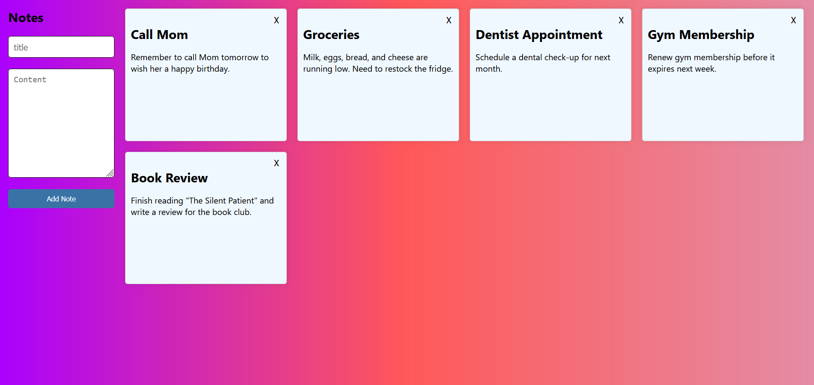

echo "# Notes API

This project is a simple RESTful API for managing notes, built with Node.js, Express, TypeScript, and Prisma ORM.

## Functionality

The API provides the following endpoints:

1. **GET /api/notes**: Retrieve all notes
2. **POST /api/notes**: Create a new note
3. **PUT /api/notes/:id**: Update an existing note
4. **DELETE /api/notes/:id**: Delete a note

Each note consists of a title and content.

## Tech Stack

- Node.js
- Express.js
- TypeScript
- Prisma ORM
- PostgreSQL (assumed, based on Prisma usage)

## Setup

1. Clone the repository
2. Install dependencies: \`npm install\`
3. Set up your database and update the DATABASE_URL in the .env file
4. Run Prisma migrations: \`npx prisma migrate dev\`
5. Start the server: \`npm start\`

The server will start on port 5000 by default, or on the port specified in the PORT environment variable.

## API Endpoints

### GET /api/notes
Retrieves all notes.

### POST /api/notes
Creates a new note. Requires a JSON body with \`title\` and \`content\`.

### PUT /api/notes/:id
Updates an existing note. Requires the note ID in the URL and a JSON body with \`title\` and \`content\`.

### DELETE /api/notes/:id
Deletes a note. Requires the note ID in the URL.

## CORS

The API is configured to accept requests only from \`https://node-express-typescript-notes-project-1.onrender.com\`.

## Error Handling

The API includes basic error handling for invalid inputs and server errors.

## Deployment

This API is designed to be easily deployable to platforms like Render or Heroku." > README.md